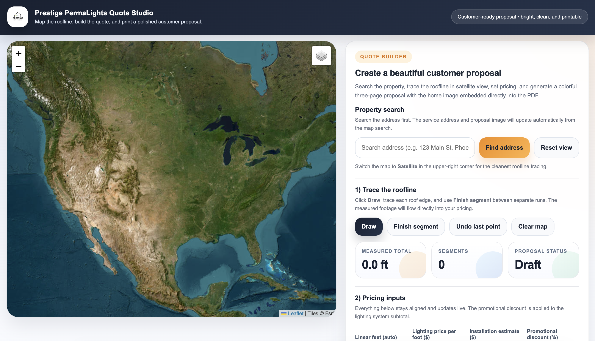
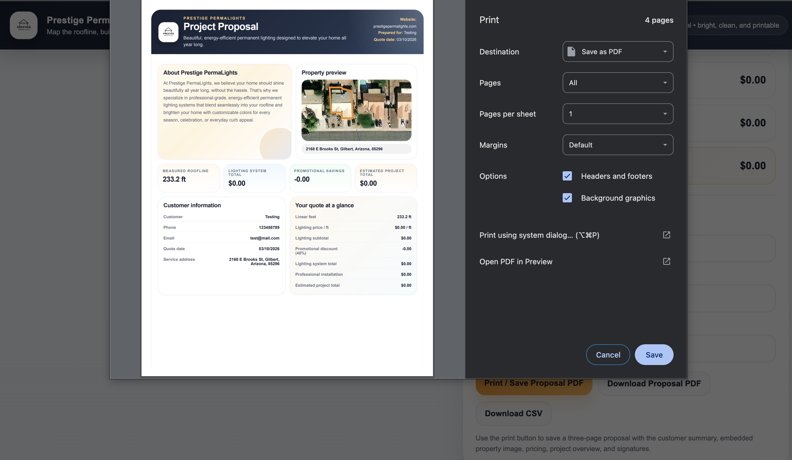
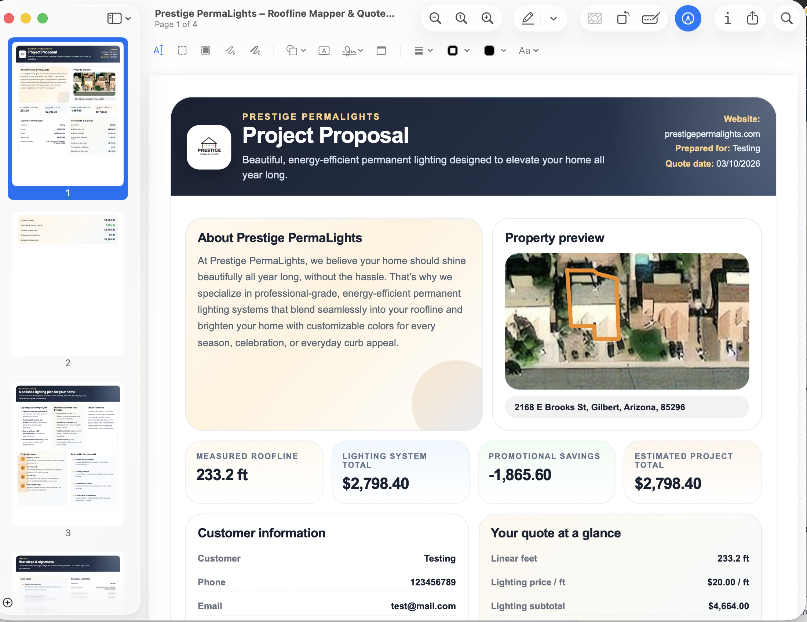

# Permanent Lighting Quote and Proposal Generator

A customer-facing quoting and proposal system built for a permanent lighting business to streamline roofline measurement, pricing, and proposal generation.

## Overview

This project was created to solve a real business problem for a permanent lighting company: generating accurate, professional customer quotes without relying on spreadsheets, manual calculators, or generic proposal templates.

The tool allows a user to search a property, map the roofline, estimate project footage, calculate pricing, apply promotional discounts, and generate a branded customer-ready proposal with signatures and PDF export.

This project demonstrates how I can translate a business need into a working digital product that improves workflow efficiency and customer experience.

## Business Problem

Permanent lighting companies often rely on manual quoting workflows that are:

- time-consuming
- inconsistent across jobs
- difficult to present professionally to customers
- harder to scale as lead volume grows

I wanted to build a lightweight web-based system that would:

- improve quote consistency
- reduce manual calculations
- create a better customer experience
- generate a polished proposal in a faster sales workflow

## Solution

I used generative AI to build a browser-based quoting application that used HTML, CSS, and JavaScript. The tool supports:

- property search and map-based roofline measurement
- pricing inputs and promotional discount logic
- customer-facing proposal generation
- property image integration
- signature capture
- print/PDF proposal output

## Core Features

- Roofline mapping workflow
- Property search
- Footage-based pricing calculator
- Promotional discount support
- Branded customer proposal
- Property image section in proposal
- Signature capture
- PDF-ready print layout
- Customer-friendly design and wording

## Tech Stack

- HTML
- CSS
- JavaScript
- Leaflet.js / map-based UI
- Netlify for deployment

## Screenshots

### Main quoting interface


### Roofline mapping workflow


### Proposal preview


### PDF output


## What This Project Demonstrates

This project highlights my ability to:

- translate business needs into a functional digital tool
- design customer-facing workflows
- build practical automation solutions
- improve user experience through iterative refinement
- create polished outputs for real-world business use
- ship a usable web-based product

## My Role

I led the product direction, workflow design, feature refinement, and final customer-facing structure of this project. I used web technologies and AI-assisted development to rapidly prototype, iterate, and improve the system into a polished business tool.

## Lessons Learned

Through this project, I worked through challenges related to:

- formatting printable proposals cleanly
- aligning customer-facing language with business goals
- balancing functionality with presentation quality
- improving usability through iterative design changes
- adapting a lightweight front-end tool for a real-world quoting workflow

## Live Demo

`https://prestige-quote-generator.netlify.app/`

## Repository Structure

```text
permanent-lighting-quote-generator/
├── index.html
├── README.md
├── LICENSE
├── assets/
│   ├── screenshot-home.png
│   ├── screenshot-mapping.png
│   ├── screenshot-proposal.png
│   └── screenshot-pdf.png
└── docs/
    └── project-overview.md
